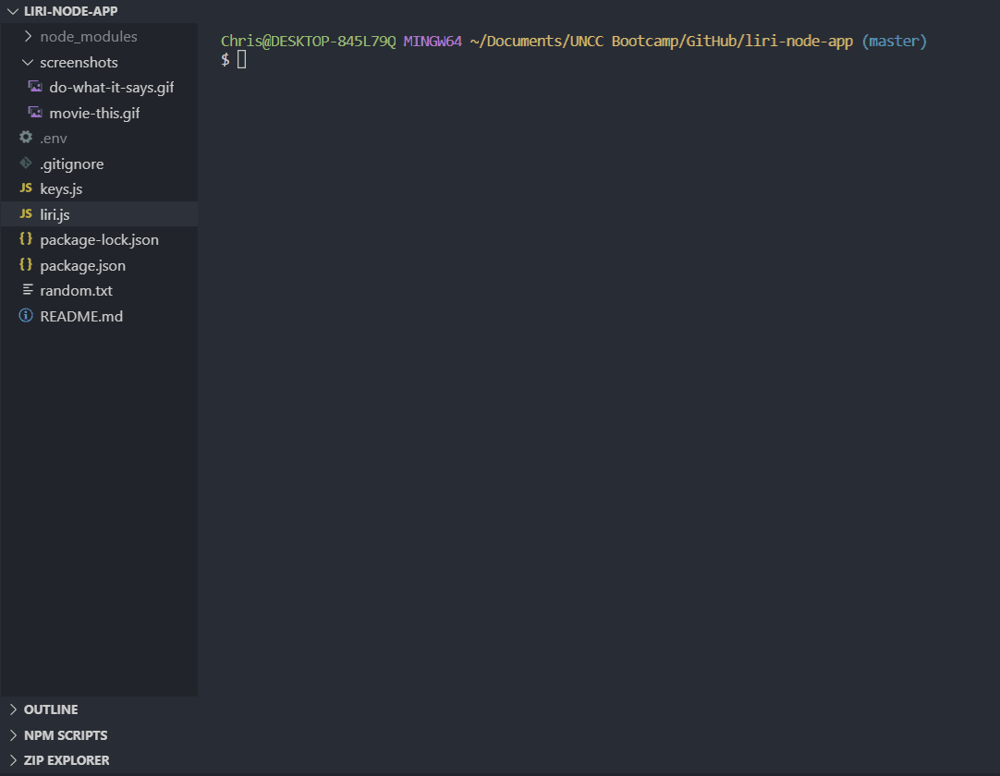
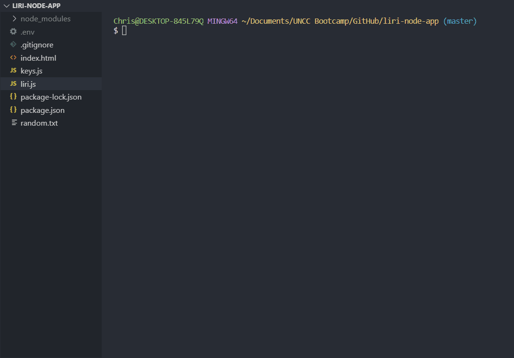
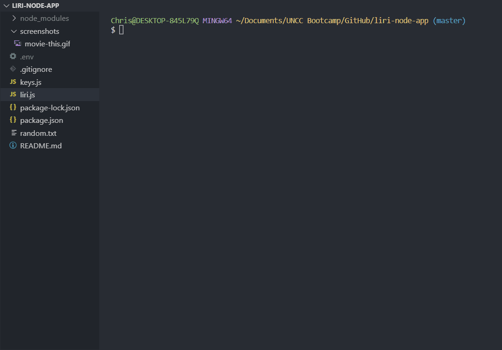

# LIRI Bot

This game is my Unit 7 homework submission for UNC Charlotte's Coding Bootcamp.  
LIRI is a Language Interpretation and Recognition Interface. It is a command line node app that takes in arguments, sends requests
using the `axios` package to the Bands in Town, Spotify and OMDB APIs, and returns data to the user. LIRI takes in the following commands: 

   * `concert-this`
   * `spotify-this-song`
   * `movie-this`
   * `do-what-it-says`
   
   
## Deployment

1. Clone repo
2. Run `npm install`
3. At command prompt run `node liri.js <pass in a command instruction from above> <enter artist, song, or movie>`

   
## Design Notes

**LIRI** searches **Bands in Town** for concerts, **Spotify** for songs, and **OMDB** for movies.

1. **`node liri.js concert-this '<artist/band name here>'`**

   * Searches the Bands in Town Artist Events API for an artist and renders the following concert information to the terminal:

     * Name of the venue

     * Venue location

     * Date of the Event (using the format "MM/DD/YYYY")
     
    * **Demonstration gif:**
   
   
 

2. **`node liri.js spotify-this-song '<song name here>'`**

   * Displays the following information about the selected song in your terminal/bash window

     * Artist(s)

     * Song name

     * A preview link of the song from Spotify

     * The album containing the song

   * If no song is provided, the program defaults to "The Sign" by Ace of Base.
   
   * **Demonstration gif:**
   
   

3. **`node liri.js movie-this '<movie name here>'`**

   * This will output the following movie information to your terminal/bash window:

       * Title
       * Year movie was released
       * IMDB Rating
       * Rotten Tomatoes Rating
       * Country where movie was produced
       * Language(s)
       * Actors in the movie
       * Plot of the movie
      

   * If the user does not enter a movie selection, the program outputs data for the movie 'Mr. Nobody.'
   
   * **Demonstration gif:**
   
   
   

4. **`node liri.js do-what-it-says`**

     * References the random.txt file to run `spotify-this-song` for "I Want it That Way".
     
     * **Demonstration gif:**
   
   

     

## Built With

* JavaScript
* [Node.js](https://nodejs.org/en/docs/)

**APIs:**

  * [Spotify API](https://developer.spotify.com/)
  * [OMDB API](http://www.omdbapi.com) 
  * [Bands In Town API](http://www.artists.bandsintown.com/bandsintown-api)

**NPM Packages:**

  * [Node-Spotify-API](https://www.npmjs.com/package/node-spotify-api)
  * [Axios](https://www.npmjs.com/package/axios)
  * [Moment.js](https://www.npmjs.com/package/moment)
  * [DotEnv](https://www.npmjs.com/package/dotenv)
  
